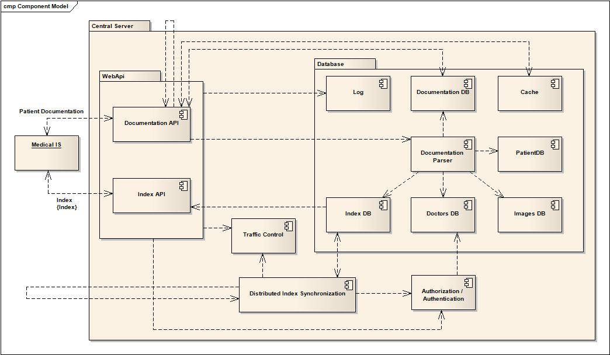
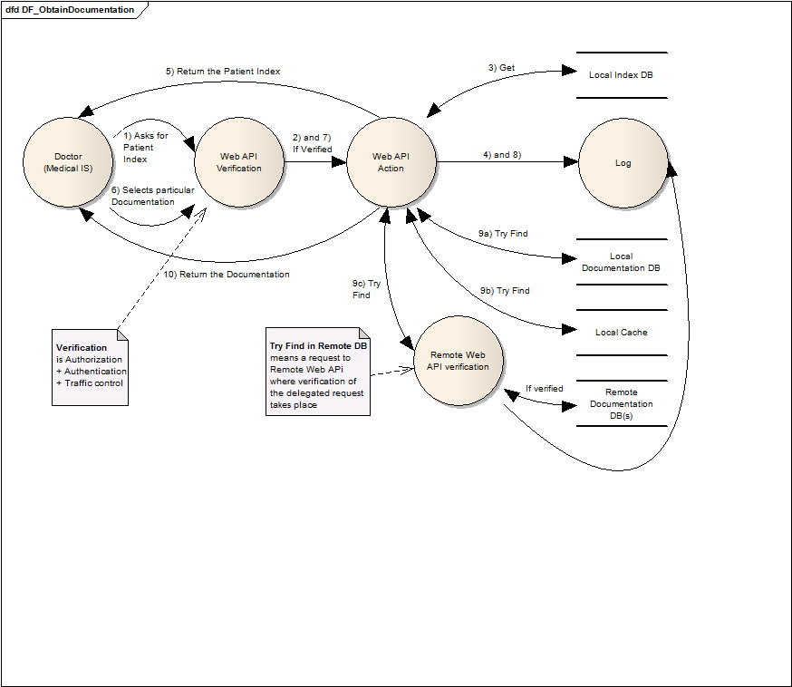

PDE - Patient Documentation Exchange
===

# Team #
- Petr Onderka (gsvick (at) gmail (dot) com)
- Filip Řepka (repik (dot) x (at) seznam.cz)
- Ondra Heřmánek (ondra (dot) hermanek (at) gmail.com)


# Úvod #

### Motivace ###
Lékař při každé návštěvě (nového) pacienta zjišťuje jeho anamnézu - zdravotní stav, předchozí nemoci, vyšetření, operace, rodinnou anamnézu a podobně. Pacient navíc nemusí všechny informace vědět, nebo může některé úmyslně zatajit. Navíc tento proces lékaři zabírá nemalé množství času.

Současný stav výměny dokumentace mezi lékaři je následující: pokud lékař posílá pacienta za jiným lékařem na nějaké vyšetření, vytiskne mu jeho kartu, kterou musí pacient s sebou donést zmíněnému lékaři. Karta tedy obsahuje jen informace od prvního lékaře. Po vyšetření by měl správně pacient kartu odevzdat svému obvodnímu lékaři, ale často se tak neděje a pacienti si kartu nechávají, ztrácí nebo vyhazují.

O řešení tohoto problému se již v minulosti snažil projekt **IZIP**, který neuspěl především z důvodu, že systém byl centralizovaný a v rukou pojišťoven, které kontrolovaly, zdali doktoři provedli vše, co vykázali (což často kvůli přísným limitům doktoři v dobré víře a snaze pomoci lidem obcházeli)

### Cíl projektu ###
Cílem tohoto projektu je navrhnout systém, který umožní lékařům získat celkovou dokumentaci pacienta a obohacovat ji. Systém bude o každém pacientu udržovat seznam všech jeho návštěv lékařů, popis vyšetření a výstupní zprávu. Tato dokumentace bude přístupná na vyžádání (při vyšetření, běhěm výjezdu sanitního vozu).

### Předpokládaná ideální situace ###
Všichni lékaři a zdravotnická zařízení vlastní telefon a počítač se zabezpečeným internetovým připojením, díky kterému budou moci pacientovu dokumentaci sdílet. Všichni lékaři se sdílením dokumentace souhlasí, všichni pacienti také.


# Vlastnosti systému #

### Celkový pohled ###


Každý zdravotní informační systém komunikuje s centralizovaným uzlem přes zabezpečené Web API. Každý požavek na centralizovaný uzel je před zpracováním verifikován - proběhne autorizace a autentizace zdravotnického systému, který požadavek vytovořil, zároveň proběhne kontrola proti zahlcení požadavky. Zdravotnický systém si může vyžádat **Index** se záznamy pacienta, ktérého zrovna léčí, nebo přímo zvolenou **Dokumentace**.

### Uložení informací ###
Systém bude centralizovat dokumentaci v uzlech (jednotlivé nemocnice) a bude distribuovat **Index** - seznam pacientů, jejich navštěv u lékařů a kód vyšetření. Tento index bude určovat, na kterém uzlu leží určitá konkrétní **Dokumentace**.

##### Dokumentace pacientů #####
Budou zřízeny centralizované uzly v nemocnicích a každému zdravotníkovi bude určen (při registraci přiřazen) jeden uzel, který bude uchovávat dokumentaci jeho pacientů.

**Dokumentace** se bude uchovávat centralizovaně v uzlech (nemocnicích). Lékaři budou dokumentaci na tyto uzly nahrávat - lékaři v nemocnicích přímo v rámci nemocničního systému, soukromí lékaři přes webové rozhraní nebo pomocí svých informačních systémů, které budou s tímto systémem komunikovat. Jednotlivé uzly se budou starat o zabezpečení osobních údajů, o dostupnost dokumentace a o aktualizaci **Index**u.

### Přístup k dokumentaci ###
Veškeré **Dokumentace** budou přístupné všem doktorům. Pro ochranu osobních údajů proti zneužití bude každá akce - vytvoření/úprava/mazání/vyžádání **Dokumentace** - zaznamenána. Bude tedy možné dohledat, který lékař přistoupil k jaké **Dokumentaci**.

Toto řešení bylo zvoleno, protože omezování přístupu lékařů k dokumentaci by vedlo k rozsáhlým komplikacím (lékař nemůže vyšetřit pacienta, protože mu omylem nebylo dáno právo přístupu k jeho dokumentaci). Na druhou stranu, do systému mají přístup jen autentizovaní doktoři, takže riziko zneužití není nepřiměřeně vysoké (ve srovnání se systémy, které jsou veřejně přístupné).

### Registrace lékařů ###
Každý lékař se zaregistruje do systému PDE, dostane pevný identifikátor a náhodně vybraný token, pod kterým bude identifikován v rámci systému, rovněž mu bude přiřazen uzel, se kterým bude jeho zdravotnický informační systém komunikovat. Při registraci uvede rovněž telefonní číslo a další potřebné údaje. 

Jako jeho identifikátor bude považována kombinace názvu jeho zdravotnického informačního systému a přihlašovacích údajů do jeho systému. Token mu bude vygenerován náhodně a bude sloužit k validaci požadavků vyslaných zdravotnickým informačním systémem lékaře.

### Vyměňované informace ###
##### Index #####
Pro **Index** očekáváme řádově desítky milionů záznamů, proto bude kladen důraz na minimální velikost jednoho záznamu. Ideálně tedy: 

<code> pacientId | lekarId | datum | typVysetreni | uzelId | dokumentId</code>

Jako ID pacienta by šlo použít jeho rodné číslo, to ale není unikátní, proto jako ID bude použijeme rodné číslo kombinované s celým jménem pacienta.

ID lékaře bude bráno jako kombinace názvu informačního systému, který používá, a přihlašovacího jména, kterým se přihlašuje. Tyto informační systémy si unikátnost přihlašovacích údajů řeší samy, tedy unikátnost takto vytvořených ID je zaručena. Případné kolize se dají řešit při registraci doktora do PDE systému.

##### Zprávy #####

- Žádost o Index: <br> <code>pacientId</code>
- Odpověď Indexu: <br> <code>dokumentId | uzelId | pacientId | lekarId | lekarTelefon | lekarInfo | typVysetreni | datumZmeny | pacientInfo</code>
- Žádost o dokumentaci: <br> <code> uzelId | dokumentId</code>
- Odpověď s dokumentací: <br> vlastní **Dokumentace**
- Vložení **Dokumentace**: <br> <code>datumVytvoreni | datumAkce | lekarId | pacientId | typVysetreni | vlastni dokumentace </code>
- Aktualizace **Dokumentace**: <br> <code>dokumentId | datumVytvoreni | datumAkce | lekarId | pacientId | typVysetreni | vlastni dokumentace </code>
- Smazání **Dokumentace**: <br> <code> dokumentID </code>
- Synchronizace indexu: <br> <code>datumVytvoreni | datumAkce | lekarId | pacientId | typVysetreni | dokumentaceId | pacientInfo</code>
- Aktualizace informací o pacientovi: <br> <code> pacientID | pacientInfo </code>
- Aktualizace informací o lékaři: <br> <code> lekarInfo </code>
- Žádost o informace o lékaři: <br> <code> lekarId </code>
- Odpověď s informacemi o lékaři: <br> <code> lekarInfo </code>

### Výkon systému ###
Nejdůležitější výkonostní požadavky na systém jsou:

- Přenesení dokumentace na uzel, který si ji vyžádal, by mělo trvat desítky sekund, maximálně jednu minutu.
- Synchronizace indexů by měla mít zpoždění do 30 minut.

Zdůvodnění: Předpokládá se, že lékaři budou ochotní na přenesení dokumentace počkat, ale ne příliš dlouho. U synchronizace indexů není kladen důraz na rychlost, protože se nepředpokládá, že by se pacient rychle přesouval mezi lékaři náležejícími pod různé nemocnice.

Největšími potenciálními problémy s výkonen systému by mohly být nároky přenášení dokumentů mezi nemocnicemi a synchronizace indexu na připojení nemocnic. Následuje velmi hrubý odhad těchto nároků:

Předpoklady výpočtu (mnohé velmi nereálné, ale pro rámcový výpočet by měly postačovat):

- za rok proběhne v ČR 140 milionů ambulantních ošetření ([Zdravotnická ročenka ČR 2012](http://www.uzis.cz/publikace/zdravotnicka-rocenka-ceske-republiky-2012): 135 786 630)
- každé ošetření bude vyžadovat přenesení jednoho dokumentu mezi nemocnicemi
- všechna ošetření probíhají během 8 pracovních hodin 250 pracovních dnů roku (simulace špičky)
- v ČR se nachází 200 nemocnic ([Nemocnice v České republice v roce 2012](http://www.uzis.cz/rychle-informace/nemocnice-ceske-republice-roce-2012): 188)
- nemocnice jsou rovnoměrně zatížené
- přenášené dokumenty mají velikost 1 MB
- záznam v indexu má 100 B

Z těchto předpokladů vychází, že v ČR probíhá 70 000 ošetření za hodinu = cca 20 ošetření za sekundu = cca 0,1 ošetření za sekundu v obvodu každé nemocnice. To znamená, že každá nemocnice bude potřebovat kapacitu 800 kb/s jak na upload, tak na download, což v dnešních podmínkách není sebemenší problém.

Vzhledem k velmi malé velikosti položek indexu bude potřeba k synchronizaci jedné nemocnice se všemi ostaními nemocnicemi cca 16 kb/s, což taktéž není problém.

Průběh zpracování požadavku na přenesení dokumentu, který není umístěný v lokální nemocnici:

1. přenos požadavku do lokální nemocnice
2. zpracování požadavku v lokální nemocnici
3. přenos požadavku do vzdálené nemocnince
4. zpracování požadavku ve vzdálené nemocnici
5. přenos dokumentu ze vzdálené nemocnince
6. zpracování dokumentu v lokální nemocnici
7. přenos dokumentu z lokální nemocnince

Pokud předpokládáme, že na přenos tohoto dokumentu je k dispozici 1 Mb/s ve všech zúčastněných síťových uzlech, tak kroky 5 a 7 každý budou trvat 8 s. Všechny ostatní kroky by měly proběhnout rychle, předpokládejme do 1 s. Dohromady na celý proces dostáváme 21 s, což je v rámci požadavků.

### Verifikace v systému ###
Verifikační proces bude před každou akcí zavolanou přes Webové API kontrolovat, že ten, kdo akci volá, má správný login a token (pokud volající je zdravotnický IS) a nebo ověří, že volá jiný centrální uzel. Zároveň v rámci verifikace požadavku proběhne i kontrola před zahlcením. Prioritu budou mít požadavky, které přicházejí z adres, které komunikují méně, tedy minimálně zahlcují systém.

TODO - Centralizovaný uzel po verifikaci požadavku 
- na **Index**: vrátí **Index** se záznamy pacienta, který má u sebe uložen v lokální databázi
- na konkrétní záznam: se podle **Indexu** rozhodne, kde záznam vyzvednout
	- buď je uložen v lokální databázi uzlu
	- nebo je uložen v lokální cache uzlu (je potřeba ověřit, že není zastaralý)
	- nebo ví, na jakém vzdáleném uzlu je uložena, tak si o záznam řekne
		- požadavek na vzdáleném uzlu je verifikován stejným mechanizmem jako požadavek zdravotnického systému. 
		- poté, co obdrží záznam, si jej uloží do své cache	

Centralizované uzly zároveň v daném intervalu synchronizují **Index** mezi ostatnímy uzly. Každý tento požadavek s novýmy/aktualizovanými záznamy je verifikován na uzlu, na který požadavek dorazí, stejným verifikačním procesem, jako ostatní (dříve zmíněné) požadavky. 

### Dostupnost systému ###
Snaha bude minimalizovat dobu neplánovaných výpadku i jejich četnost. Počítá se s pravidlnými údržbami, které se budou provádět mimo špičku, ideálně po půlnoci, kdy se předpokládá minimální počet požadavků na systém.

##### Výpadky #####
- plánované výpadky
	- hodina měsíčně na údržbu (kolem 1:00 ráno)
- neplnánované výpadky
	- 30 minut měsíčně

##### Výpočet dostupnosti #####
**MTBF** = předpokládáme polovinu měsíce = 360 hodin

**MTTR** = předpokládáme 3/4 hodiny (1 hodina plánovaný výpadek(údržba), 0,5 hodiny neplánovaný výpadek; průměr = 0.75 hodiny) = 0.75 hodiny

```Availability = MTBF / (MTBF + MTTR) = 360 / (360 + 0,75) = 0.9979```

Tedy celková dostupnost systému bude činit zhruba 99,8% procent. Tímto se náš systém bude řadit do třídy spolehlivosti 2 - Managed ([slidy RNDr. Jakub Lokoč, Ph.D.](https://docs.google.com/viewer?url=http://siret.ms.mff.cuni.cz/lokoc/UK/Transakce.pdf)).

##### Ochrana proti DoS #####
Systém bude obsahovat modul ```Traffic Control```, který bude kontrolovat zatížení serverů. V případě přetížení nebude zpracovávat některé požadavky.

### Bezpečnost ###
K zajištění bezpečnosti je potřeba určit, proti jakým druhům útoků se budeme bránit. Předpokládané druhy útoků jsou:

- útočník bude předstírat, že je nemocnicí, při komunikaci s jinou nemocnicí nebo s lékařem
- utočník bude předstírat, že je lékařem, při komunikaci s nemocnicí
- útočník je lékař a bude přistupovat k datům, která nepotřebuje

Pro zabránění prvního případu budou všechny nemocnice vybaveny certifikátem, který se bude ověřovat při každé komunikaci s jinou nemocnicí nebo s lékařem. Všechny certifikáty nemocnic budou podepsány centrální autoritou. Bude také existovat revokační seznam, pro případ kompromitace privátního klíče nemocnice.

Pro ochranu před druhým případem se bude používat kombinace přihlašovacího jména a hesla lékaře. Toto heslo bude platné jenom v nemocnici, pod jejíž obvod lékař patří. Nemocnice budou používat standartní praktiky pro ukládání hesel (ukládá se jenom hash hesla, používá se salt).

Předpokládá se, že lékař se už přihlašuje do svého systému heslem, takže heslo pro komunikaci s nemocnicí může být uloženo na jeho disku zašifrované heslem pro přístup k jeho systému.

Lékař nikdy nebude přímo komunikovat se vzdálenými nemocnicemi, takže tento případ není potřeba řešit.

Veškerá komunikace bude zašifrovaná pomocí TLS, v případě nemocnice pomocí klíče z jejího certifikátu.

Případ, že útočník je lékař (případně někdo, kdo získal jeho heslo) se bude řešit jen logováním: každý přístup do systému se bude logovat, podezřelé přístupy se budou vyšetřovat. Pokud se tímto způsobem zjistí neoprávněný přístup k dokumentům, danému doktorovi se zakáže přistupovat do systému.

Tady se počítá s tím, že přístup k datům může být důležitý. To znamená, že jakékoliv omezování přístupu je nevhodné a že zvýšené riziko neoprávněného přístupu je akceptovatelné.

# Nároky systému #

### Uzly ###

Od serverů v nemocnicích požadujeme:

* připojení k Internetu rychlostí alespoň 2 Mb/s v obou směrech (1Mb/s na komunikaci s ostatními ulzly, 1Mb/s na komunikaci s lékaři)
* místo na disku pro data 1 TB na každý rok (700 GB data, která patří tomuto uzlu; 14 GB index dat všech uzlů)
* 2 GHz CPU, 1 GB RAM (požadavky nejsou vysoké, protože sever nebude provádět složité výpočty)
* servery i disky zdvojené, pro zajištění vyšší spolehlivosti

### Počítače lékařů ###

Na počítače lékařů nejsou kladeny žádné zvláštní požadavky, stačí libovolný moderní desktop s 1 Mb/s přístupem k Internetu (tato rychlost je potřeba k dosažení požadované latence).


# Kvalitativní atributy systému #

- [Kvalitativní atributy](http://msdn.microsoft.com/en-us/library/ee658094.aspx)
	- ***Design Qualities***
		- **Conceptual Integrity**
			- Takto robustní systém je potřeba dobře rozmyslet a navrhnout, ustanovit jednotný coding style, navrhnout základní postupy při vývoji, strategii a organizaci týmu, ... 
		- Maintainability
			- Nebude snadné jednoduše provést aktualizaci distribuovaného systému, takže by se na možná rozšíření mělo myslet už při návrhu (například počítat s podporou obrázků v dokumentaci pacienta).  
		- Reusability
			- Systém bude nabízet API pro komunikaci s ostatnímy systémy
	- ***RunTime Qualities***
		- **Availability**
			- Měl by být kladen důraz na dostupnost API, která sbírají data od doktorů a ukládají je do nemocničních IS (99%).
			- Dostupnost dokumentace z nemocničního IS už nemusí být tak ostře hlídána (95%). **TODO: upřesnit,jak jsme došli k těm číslům**
		- **Performance**
			- Distribuovaný systém vyžaduje režii na synchronizaci uzlů, proto je potřeba minimalizovat velikost a počet zpráv určených na synchronizaci **Indexu**. Na rychlost přenesení nových informací pomocí synchronizace není kladen zásadní důraz. Za rozumnou horní hranici potřebného času je považováno 30 minut.
			- Od systému je požadováno, aby byl schopen v rozumném čase přenášet dokumentaci na uzel, který si ji vyžádá. *V rozumném čase* znaméná řádově desítky sekund, horní hranice je jedna minuta.
		- **Reliability**
			- Kladen větší důraz a dostupnost WEB API než na systém přednosu dokumentace. 
		- **Interoperability**
			- Kladen důraz na jednoduchou změnu implementaci komunikace s centrálním WEB API u doktorských IS. Jednoduché zabezpečené API (https), jednoduché zprávy ve standardizovaném formátu (XML).
			- Možnost parsovat interní formáty dokotrských IS na straně cenrálních IS.
		- **Security**
			- Systém bude manipulovat s citlivými daty a uchovávat je. Vymyslet způsob, jak se bránit DOS útokům, falešným zprávám, falešným doktorům, logovat přístupy pro ochranu osobních údajů.
		- Scalability
			- Už při návrhu je nutné počítat s velkým množstvím přenášených a uchovávaných dat. Velikost přenášených zpráv kolísat nebude, ale velikost ukládaných dat stále poroste.
			- Tedy spíše *horizontální škálování* (úložné kapacity) než *vertikální škálování* (přenosové kapacity)
		- Manageability
			- Systém se principiálně jen úložiště citlivých dat, moc lidí by jej spravovat nemělo.
	- ***User Qualities***
		- Usability 
			- Uživatelé přijdou do styku se systémem pouze prostřednictvím svých IS, které nejsou součástí toho systému.


# Případy použití #

### Nahrání dokumentace ###


Tento diagram znázorňuje tok dat při nahrání dokumentace
- Doktor vytvoří/upravé ve svém IS, ten se pošle přes Web API určeného centralizovaného uzlu, kde se verifikuje.
- Pokud verifikace proběhne úspěšně, záznam se uloží a aktualizuje se **Index**.
 


Tento diagram detailněji popisuje průběh vytvoření/aktualizace dokumentace pacienta.

### Vyžádání dokumentace ###


Tento diagram ukazuje, jak probíhá získání dané dokumentace
- Doktor si nejprve vyžádá **Index** dokumentace o pacientovi
- Poté vybere konkrétní dokument, který ho zajímá, a centralizovaný uzel mu jej vyhledá a najde. Každý požadavek je verifikován.


Tento diagram detailněji popisuje průběh vyžádání dokumentace pacienta. 

### Distribuce Indexu ###


Tento diagram popisuje průběh synchronizace **Index**u mezi všemy uzly.
- Každý uzel zjistí ze své lokální databáze, které záznamy přibyly/byly změněny od poslední synchronizace a tyto záznamy (jako **Index**) rozešle na všechny ostatní uzly
- Zároveň si kontroluje potvrzení, kterými mu ostatní uzly dávají vědět, že zpracovaly nový obsah **Indexu**. V případě nedodržení potvrzení je **Index** na daný uzel posílán opakovaně, dokud se operace nepodaří.


# Slovník pojmů #

Zde je uveden význam používaných pojmů

- **Dokumentace** - Záznam o vyšetření pacienta
- **Index** - Záznam o tom, na kterém uzlu ze nachází jaká **Dokumentace**
- **Centrální uzel** - Uzel, kde se ukládá **Dokumentace**, **Index** a odkud se distribuují okolním uzlům a doktorům
	- *lokální* - uzel, kam doktor nahrává  **Dokumentaci** (myšleno v kontextu doktora)
	- *vzdálený* - ostatní uzly, kde se nachází dokumentace, doktor na něj dokumentaci nenahrává, pouze ji může získat (myšleno v kontextu doktora)
